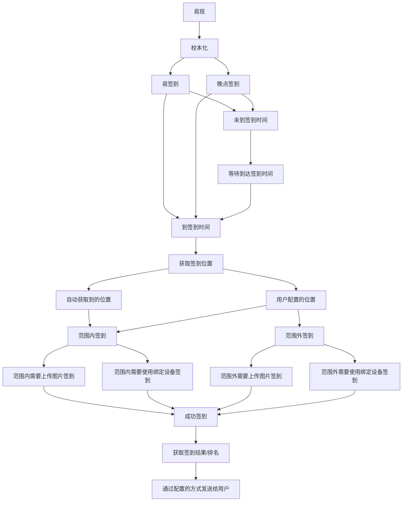

# 实现功能

- [x] 易班签到(基于易班校本化的签到都可以使用此脚本)
  - [x] 多用户签到
  - [x] 获取签到排名
  - [x] 自动校正签到时间
  - [x] 签到提交
    - [x] 自动获取签到位置
    - [x] 使用绑定的设备签到
    - [x] 自定义位置
    - [X] 图片签到
- [x] 易签到(易班app内签到分支)
  - [x] 多用户签到
  - [x] 获取签到结果
  - [x] 自动校正签到时间
  - [x] 签到提交
    - [x] 自动获取签到位置
    - [x] 自定义位置
    - [X] 图片签到
- [ ] 易班销假（无账号，无法抓包，无法写脚本）
- [x] 签到程序自动更新
- [x] 多线程签到（多用户、多学校、不同签到入口同时完成）
- [x] 签到结果微信推送
  - [X] pushplus推送加（目前需要实名认证后才可使用，认证费用1元由推送加收取，与本脚本无关）
```diff
- 图片签到有校内和校外之分，目前仅测试过校外
```
#### 如果您的学校不支持此脚本或在使用中有任何问题，请提交Issues联系我

# 警告
## 使用本项目，您必须接受以下内容，否则应当退出此页：
### 此脚本仅开源基础功能，完整功能由开源者控制，仅供个人免费研究使用，控制的内容包括：
#### 设备允许签到的数量
#### 用户是否允许签到
#### 强制更新脚本

* 此项目运行过程中会收集您的个人信息（用于控制单一设备用户数量）
* 仅额外提供给“记性较差忘记签到”的人
* 使用此脚本有可能违反您所在 单位/学校 的规章制度
* 使用此脚本所造成的一切后果您应当明白，包括但不限于：
* 账号被封停
* 您个人被给予相关处罚
> 使用并复制此脚本，则默认视为您 已经接受 了此免责声明。请仔细阅读
> 
- - - 
# 支持学校列表（排名按已知先后顺序）
```diff
+ 福建林业职业技术学院  晚签
- 佳木斯大学 （暂不确定）
+ 台州学院  晚签
+ 福州大学  晚签
+ 三江学院  晚签
- 四川轻化工大学  （暂不确定）
+ 南京工程学院 早签
+ 东莞职业技术学院  易伴云  晚签
+ 闽南科技学院
+ 哈尔滨商业大学
+ 东莞职业技术学院
- 黑龙江科技大学 （暂不确定）
+ 昆明冶金高等专科学校
- 江门职业技术学院 （暂不确定）
+ 广东食品药品职业学院  晚签
+ 福州大学至诚学院  易伴云 晚签
- 四川工业科技学院  （暂不确定）
- 海南卫生健康职业学院  （暂不确定）
+ 广西建设职业技术学院  晚签
- 福建医科大学  （暂不确定）
- 广东金融学院  （由于碰到的素质极差，永不支持，源代码层面禁用）
- 更多学校敬请反馈
```
- - - 
### [下载点此](https://github.com/2117516450/yiban-signin/releases)
- - - 
### [程序使用帮助|讨论](https://github.com/2117516450/yiban-signin/issues/10)
### 程序使用帮助|讨论QQ群 `643200955`
- - - 
此脚本已开源部分代码及制作方式/思路：
https://www.wcyuns.cn/archives/yiban

将视情开源所有代码
- - - 


### 脚本基于python，理论上支持各种平台

# 运行环境
## Windows
已封装`exe` 已在`Windows11` `Windows10`上测试通过（理论上全Windows通用）
## Linux
已测试编译发布ARM及X86版本，如有其他需求或在使用过程中出现问题，请提交issues

# 运行方式
## Windows
双击 易签.exe 后，会自动在目录下生成 user_status.json 文件，填写 user_status.json 文件后重新运行程序即可开始签到
### Windows 下自动运行
使用 任务计划程序  详细配置请参照[任务计划程序启动闪退](https://github.com/2117516450/yiban_signin/issues/13)
## Linux
运行./yiqian.bin即可，同目录下填写`user_status.json`文件
### Linux 下自动运行
都用上linux了应该自己会设置自动签到了
注意：一定要`cd`到脚本所在目录，不然无法获取配置文件

# 配置脚本
详细配置详解请到： [json配置](https://github.com/2117516450/yiban-signin/blob/main/json.md)

脚本使用已经尽量简便化

基础使用只需要在配置中填写易班的账号密码

只要正确输入账号密码就可以开始自动签到

详细配置在`user_status.json`文件中（运行exe后自动生成）
如对配置脚本有疑问，请提交Issues联系我

# 用户配置

## 单用户账户配置

```json
"user": [
{
    "enable": "1为启用账户签到，0为不启用账户签到",
    "user": "这里填用户的账号",
    "password": "这里填用户的账户密码",
    "PhoneModel": "这里填用户的设备编号(不填则自动获取)",
    "pushplustoken": "这里填pushplus(推送加)的token（如不使用可以不填）",
    "yiqiandao_name": "这里填易签到的签到模块（中文）非易签到用户不填",
    "LngLat": {
        "stat": "为0自动获取经纬+随机计算的经纬，为1使用填写的固定经纬度,默认为0",
        "lon": "填写签到经度,如100.254877123456（保留6位小数）",
        "lat": "填写签到纬度,如20.123456（保留6位小数）",
        "Adders": "填写签到地址,如：**省**市**区**镇**学院(**校区)",
        "Reason": "填写使用在范围外签到(或者图片签到)的原因（非必填）",
        "photopath": "如果需要上传图片，填写图片的完整路径，路径不要有引号，尽量使用jpg图片，范例如下：",
        "#photopath-说明": "/home/user/photo.jpg"
      }
}
]
```

## 多用户账户配置

```json
"user": [
{
    "enable": "1为启用账户签到，0为不启用账户签到",
    "user": "这里填用户的账号",
    "password": "这里填用户的账户密码",
    "PhoneModel": "这里填用户的设备编号(不填则自动获取)",
    "pushplustoken": "这里填pushplus(推送加)的token（如不使用可以不填）",
    "yiqiandao_name": "这里填易签到的签到模块（中文）非易签到用户不填",
    "LngLat": {
        "stat": "为0自动获取经纬+随机计算的经纬，为1使用填写的固定经纬度,默认为0",
        "lon": "填写签到经度,如100.254877123456（保留6位小数）",
        "lat": "填写签到纬度,如20.123456（保留6位小数）",
        "Adders": "填写签到地址,如：**省**市**区**镇**学院(**校区)",
        "Reason": "填写使用在范围外签到(或者图片签到)的原因（非必填）",
        "photopath": "如果需要上传图片，填写图片的完整路径，路径不要有引号，尽量使用jpg图片，范例如下：",
        "#photopath-说明": "/home/user/photo.jpg"
      }
},
{
    "enable": "1为启用账户签到，0为不启用账户签到",
    "user": "这里填用户的账号",
    "password": "这里填用户的账户密码",
    "PhoneModel": "这里填用户的设备编号(不填则自动获取)",
    "pushplustoken": "这里填pushplus(推送加)的token（如不使用可以不填）",
    "yiqiandao_name": "这里填易签到的签到模块（中文）非易签到用户不填",
    "LngLat": {
        "stat": "为0自动获取经纬+随机计算的经纬，为1使用填写的固定经纬度,默认为0",
        "lon": "填写签到经度,如100.254877123456（保留6位小数）",
        "lat": "填写签到纬度,如20.123456（保留6位小数）",
        "Adders": "填写签到地址,如：**省**市**区**镇**学院(**校区)",
        "Reason": "填写使用在范围外签到(或者图片签到)的原因（非必填）",
        "photopath": "如果需要上传图片，填写图片的完整路径，路径不要有引号，尽量使用jpg图片，范例如下：",
        "#photopath-说明": "/home/user/photo.jpg"
      }
}
]
```
注意：多用户就是把单用户的配置文件复制粘贴一遍，但是中间用英文`,`分割

更多用户以此类推

## 签到位置

```json
    "LngLat": {
        "stat": "为0自动获取经纬+随机计算的经纬，为1使用填写的固定经纬度,默认为0",
        "lon": "填写签到经度,如100.254877123456（保留6位小数）",
        "lat": "填写签到纬度,如20.123456（保留6位小数）",
        "Adders": "填写签到地址,如：**省**市**区**镇**学院(**校区)，如果自动获取的地址有误，可自行修改，此行有最高优先级",
        "Reason": "填写使用在范围外签到(或者图片签到)的原因（非必填）",
        "photopath": "如果需要上传图片，填写图片的完整路径，路径不要有引号，尽量使用jpg图片，范例如下：",
        "#photopath-说明": "/home/user/photo.jpg"
      }
```

需要修改`lon` `lat`和`Address`

获取签到座标及地址可以参考: 

# 完整配置解析

```json
{
  "#-说明1": "修改本文件必看",
  "#-说明2": "此文件是保存用户登录信息及签到的配置文件",
  "#-说明3": "如不清楚请不要修改 LngLat 下的数据",
  "#-说明5": "除非提示经纬度获取失败,否者不要动LngLat下的数据",
  "#-说明6": "配置文件内所有符号均为英文输入法下符号,如,{}[];输入中文符号会导致配置文件读取失败",
  "#-说明7": "错误修改可能导致程序崩溃",
  "user": [
    {
      "enable": "0",
      "user": "",
      "password": "",
      "PhoneModel": "",
      "PhoneCode": "",
      "pushplustoken": "",
      "yiqiandao_name": "",
      "LngLat": {
        "stat": 0,
        "lon": "",
        "lat": "",
        "Adders": "",
        "Reason": "",
        "photopath": ""
      }
    }
  ],
  "reset": 0,
  "#reset-说明": "1为遇到签到错误自动重新运行，2为遇到所有错误都自动重新运行（包括网络错误，与'skip'冲突），0为不自动运行，自动运行有可能导致使用pushplus遭到封号",
  "skip": 1,
  "#skip-说明": "1为遇到运行错误自动跳过，2为遇到所有错误都自动跳过（包括网络错误），0为不自动跳过，使用自动跳过有可能导致漏签",
  "exit": 0,
  "#exit-说明": "1为签到完成后自动退出，0为不自动退出，自动退出方便服务器后台运行签到程序",
  "start": 0,
  "start-说明": "值为0为不开启签到延时，为其他数字则代表全局签到时间将在签到开始后1至start数值内随机延时签到",
  "threaded": 1,
  "threaded-说明": "0为不使用多线程签到，1为使用多线程签到，默认不启用，如'log'项不为OFF，则强制不使用多线程",
  "log": "OFF",
  "#log-日志说明": "OFF(关闭)|INFO(信息)|debug(调试)",
  "#user-单用户说明": [
    {
      "enable": "1为启用账户，0为不启用账户",
      "user": "这里填用户的账号",
      "password": "这里填用户的账户密码",
      "PhoneModel": "这里填用户的设备编号(不填则自动获取)",
      "pushplustoken": "这里填pushplus(推送加)的token（如不使用可以不填）",
      "yiqiandao_name": "这里填易签到的签到模块（中文）非易签到用户不填",
      "LngLat": {
        "stat": "为0自动获取经纬+随机计算的经纬，为1使用填写的固定经纬度,默认为0",
        "lon": "填写签到经度,如100.254877123456（保留6位小数）",
        "lat": "填写签到纬度,如20.123456（保留6位小数）",
        "Adders": "填写签到地址,如：**省**市**区**镇**学院(**校区)",
        "Reason": "填写使用在范围外签到(或者图片签到)的原因（非必填）",
        "photopath": "如果需要上传图片，填写图片的完整路径，路径不要有引号，尽量使用jpg图片，范例如下：",
        "#photopath-说明": "/home/user/photo.jpg"
      }
    }
  ],
  "#user-多用户说明": [
    {
      "enable": "1为启用账户，0为不启用账户",
      "user": "这里填用户1的账号",
      "password": "这里填用户1的账户密码",
      "PhoneModel": "这里填用户1的设备编号(不填则自动获取)",
      "pushplustoken": "这里填pushplus(推送加)的token（如不使用可以不填）",
      "yiqiandao_name": "这里填易签到的签到模块（中文）非易签到用户不填",
      "LngLat": {
        "stat": "为0自动获取经纬+随机计算的经纬，为1使用填写的固定经纬度,默认为0",
        "lon": "填写签到经度,如100.254877123456（保留6位小数）",
        "lat": "填写签到纬度,如20.123456（保留6位小数）",
        "Adders": "填写签到地址,如：**省**市**区**镇**学院(**校区)",
        "Reason": "填写使用在范围外签到(或者图片签到)的原因（非必填）",
        "photopath": "如果需要上传图片，填写图片的完整路径，路径不要有引号，尽量使用jpg图片，范例如下：",
        "#photopath-说明": "/home/user/photo.jpg"
      }
    },
    {
      "enable": "1为启用账户，0为不启用账户",
      "user": "这里填用户2的账号",
      "password": "这里填用户2的账户密码",
      "PhoneModel": "这里填用户2的设备编号(不填则自动获取)",
      "pushplustoken": "这里填pushplus(推送加)的token（如不使用可以不填）",
      "yiqiandao_name": "这里填易签到的签到模块（中文）非易签到用户不填",
      "LngLat": {
        "stat": "为0自动获取经纬+随机计算的经纬，为1使用填写的固定经纬度,默认为0",
        "lon": "填写签到经度,如100.254877123456（保留6位小数）",
        "lat": "填写签到纬度,如20.123456（保留6位小数）",
        "Adders": "填写签到地址,如：**省**市**区**镇**学院(**校区)",
        "Reason": "填写使用在范围外签到(或者图片签到)的原因（非必填）",
        "photopath": "如果需要上传图片，填写图片的完整路径，路径不要有引号，尽量使用jpg图片，范例如下：",
        "#photopath-说明": "/home/user/photo.jpg"
      }
    },
    "2用户举例，可添加更多用户,完整复制 {}, 内的内容粘贴在后面即可",
    "设备型号推荐自动获取，填写错误会导致签到失败",
    "pushplus(推送加)是集成了微信、短信、邮件、企业微信、HiFlow连接器、钉钉、飞书等渠道的信息推送平台",
    "为使用方便，强烈建议注册并填写获取到的token，可以很方便的获取签到成功状态"
  ],
  "config_version": "420"
}
```

- - -

# 特别说明
* 第一次使用如提示登录失败需要在同一网络下在手机上将易班重新登录即可
* 同一网络指：共用一个wifi、共用一条宽带
* 如过一段时间出现登录不上，签不了到的情况，请登录手机易班一次即可
* python 脚本完全开源时间待定

# 感谢名单
感谢@xiaonanbunan 提供账号密码帮助测试脚本
